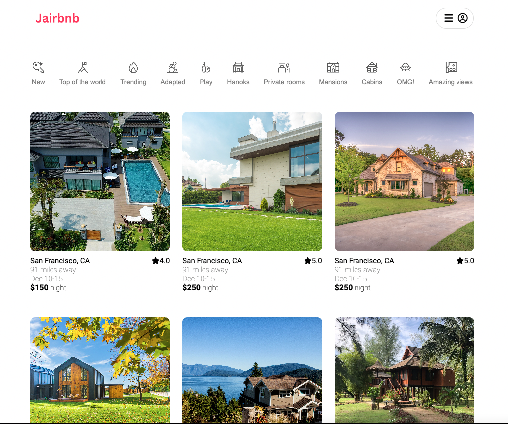
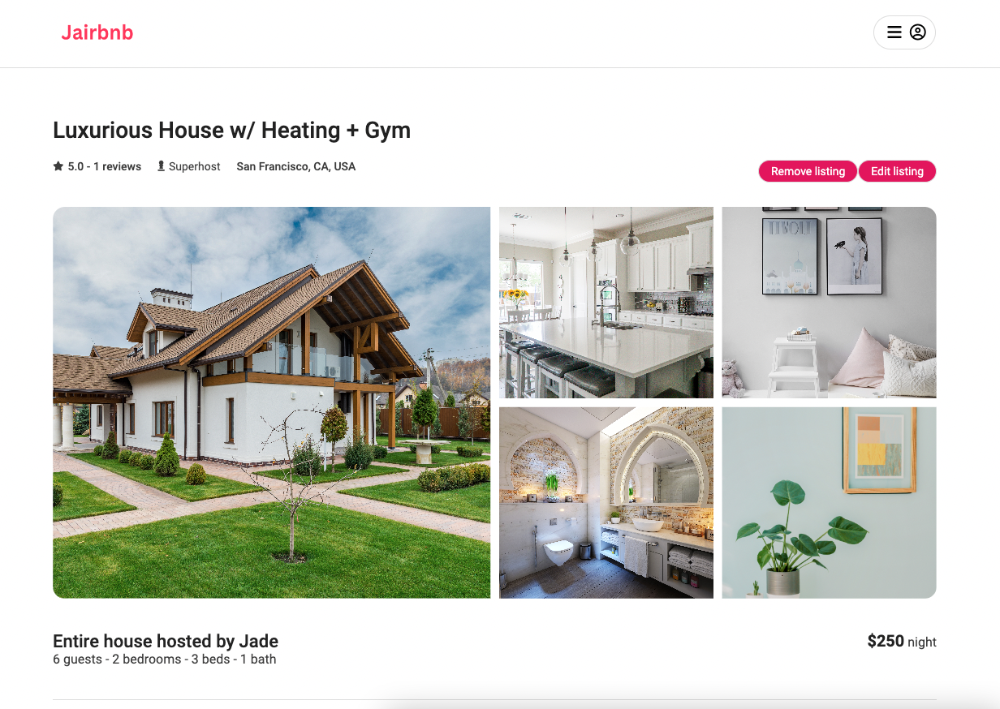
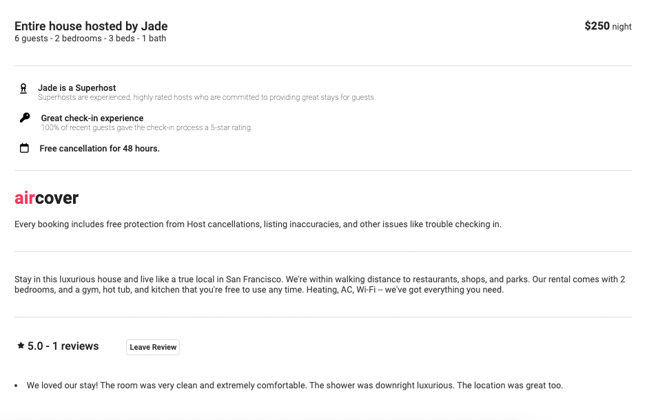
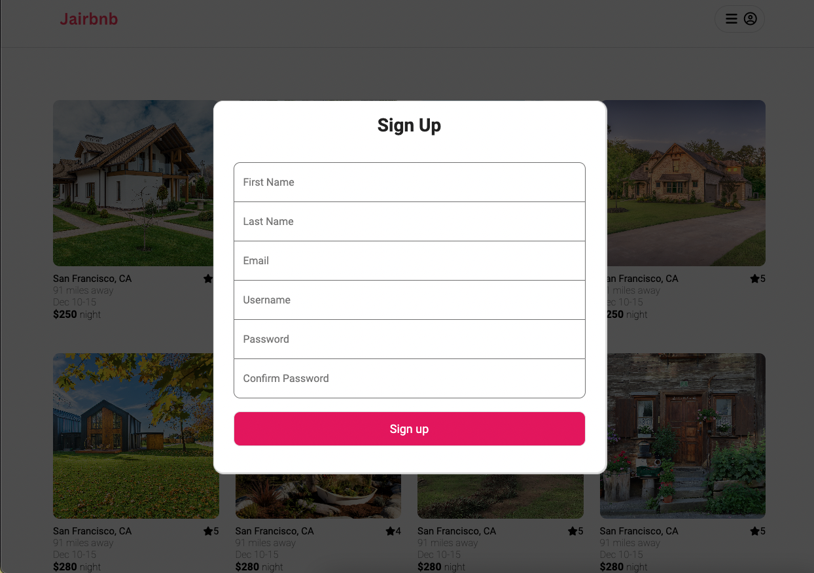
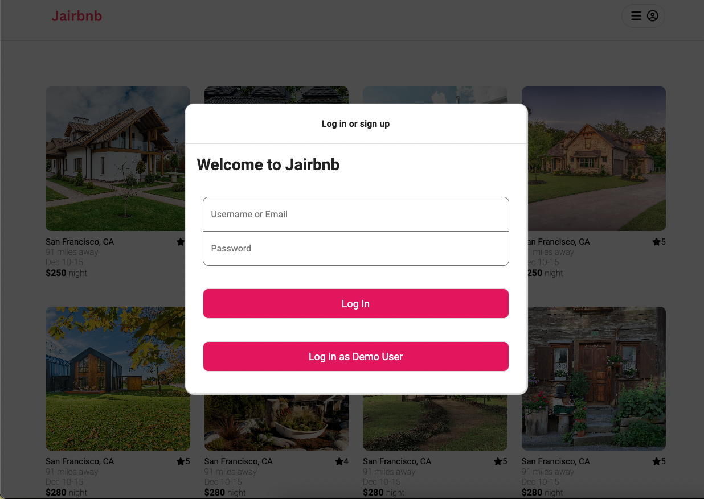
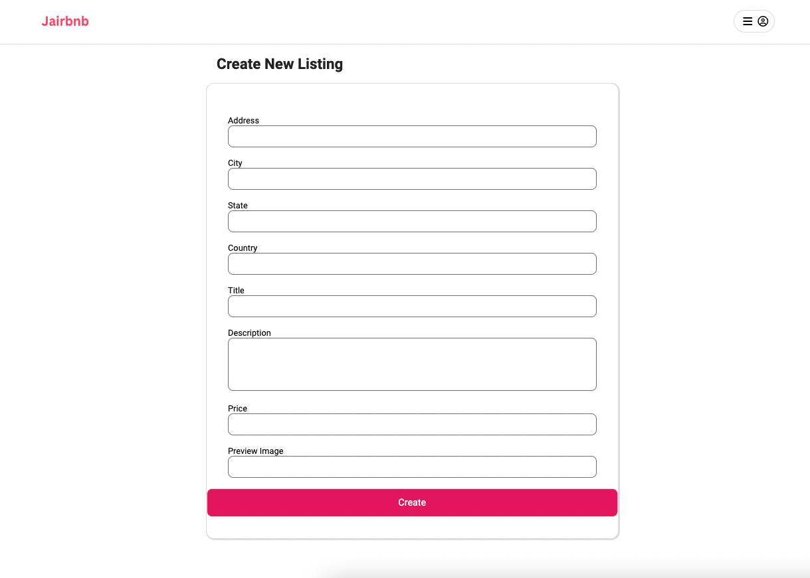
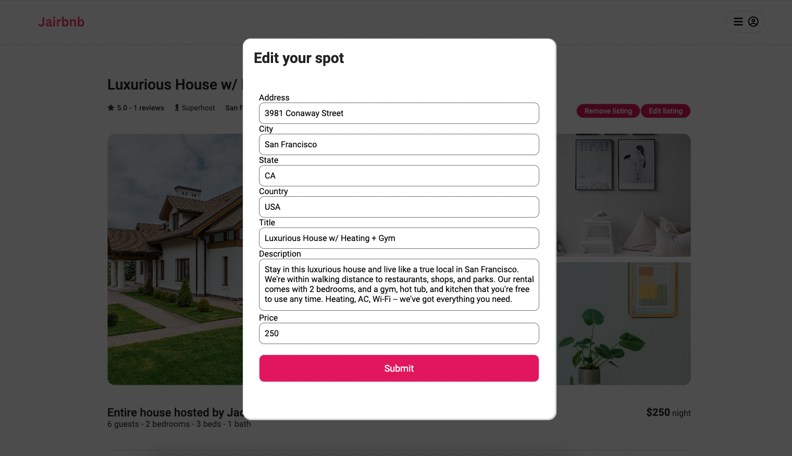
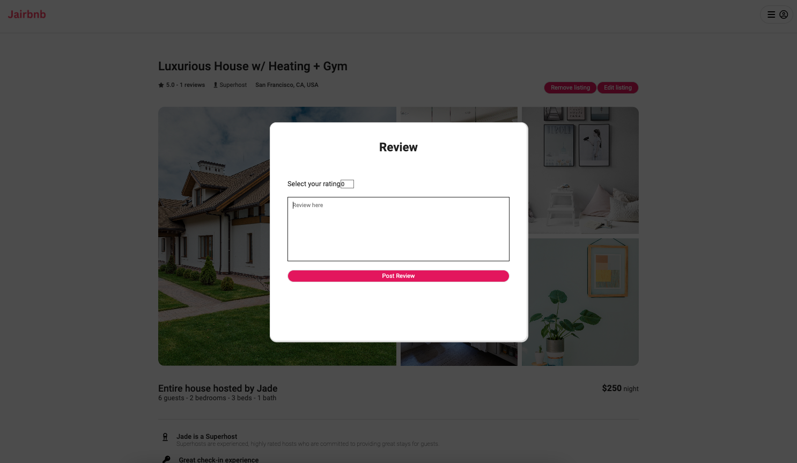

## About Jairbnb:

Jairbnb is a web application inspired by Airbnb, that provides an online marketplace for lodging, primarily homestays for vacation rentals, and tourism actitivies.

Click here to explore more: [Jairbnb live site]

## Wiki Link
- [Backend Routes]
- [Database Schema]
- [Feature List]
- [Frontend Routes]

This project is built with:

Database:

Hosting:

## Feauture Directions:

### Load all available spots:

### Load specific spot:

### Sign up new account
You will be able to create new account and log in at the same time
 

### Sign in/ Demo User:
You will be able to text feautures without sign up by click on the "Demo User" in the sign in form.
 

### Create new spot:
You will be able to host your spot
 

### Update new spot:
You will be able to update your spot
 

### Delete spot:
You will be able to delete your spot

### Leave review:
You will be able to leave review for other spots
 

### Delete review
You will be able to delete your review

<!-- external links -->

[Jairbnb live site]: https://slack.com/help/articles/202288908-Format-your-messages
[Backend Routes]: https://github.com/jadevie/Jairbnb-clone-API-project/wiki/API-Documentation
[Database Schema]: https://github.com/jadevie/Jairbnb-clone-API-project/wiki/Database-Schema
[Feature List]: https://github.com/jadevie/Jairbnb-clone-API-project/wiki/Feature-List
[Frontend Routes]:https://github.com/jadevie/Jairbnb-clone-API-project/wiki/Frontend-Routes
